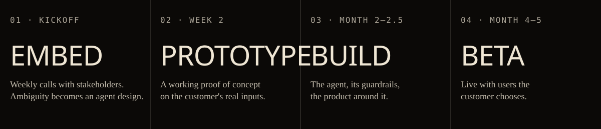

  

### I deploy agentic systems inside the customer.

On the weekly call with your stakeholders, then building the agent pipelines, services and frontends myself — **working POC in two weeks, live beta inside five months.**

### How an engagement runs

**20+** client products · **10+** from empty repository to live beta · **10** domains · **6** as project lead · **3,792** commits since Feb 2025

### Approach

| | |
|---|---|
| **#1 Embed** | Start on the call. Requirements arrive ambiguous; I turn them into an agent design. |
| **#2 Design** | Structure first, model second. Planners, tools and staged pipelines give the agent a shape. |
| **#3 Guard** | Gates before output. Verification gates, bounded repair, fail-closed steps. |
| **#4 Measure** | Evals, not vibes. Deterministic checks plus model judges on fixed datasets. |
| **#5 Integrate** | Into their stack. Auth, tenancy, provider abstraction, rate limits, concurrency. |
| **#6 Ship** | Past the demo. Beta with real users, release pipelines, embeddable SDKs. |

### Built at TheAgentic

- **[CortexON](https://github.com/TheAgenticAI/CortexON)** — open-source generalised agent for everyday task automation · ★ 450+ · frontend contributor
- **[TheAgenticBench](https://github.com/TheAgenticAI/TheAgenticBench)** — open-source digital-worker framework for agent-driven research · ★ 50+ · frontend contributor
- **TheAgentic Console** — developer console for TheAgentic's AI infrastructure · built the entire UI

### Stack

`Python` `TypeScript` `Go` `SQL` · `FastAPI` `Node.js` · `React` `Next.js` `Tailwind CSS` · `PostgreSQL` `Redis` `Docker` `AWS` `Auth0`

  <a href="https://bhumil-modi.vercel.app"><b>Portfolio</b></a> ·
  <a href="https://www.linkedin.com/in/bhumil-modi-430148190">LinkedIn</a> ·
  <a href="mailto:bhumilmodi2002@gmail.com">bhumilmodi2002@gmail.com</a> ·
  <a href="https://bhumil-modi.vercel.app/Bhumil-Modi-Resume-FDE.pdf">Resume</a>

